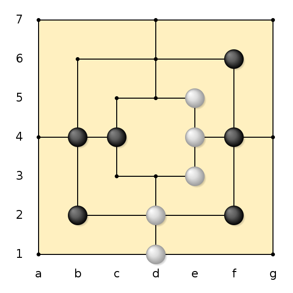

# 1001 Men's Morris

A C# dotnet 8 game engine for Nine Men's Morris using bitwise operations and flags to make hings move and groove 

## What is this ?

Nine men's morris is a very fun, ancient ass board game. 
Spend a few minutes learning how to play this, it's a fuckin class time

I first found out about this from the Netflix show: The Devil's Plan

https://en.wikipedia.org/wiki/Nine_men's_morris

