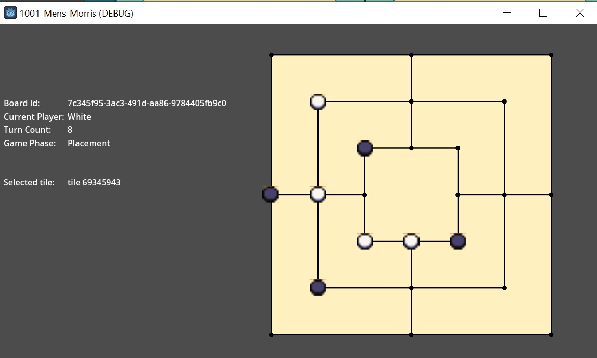
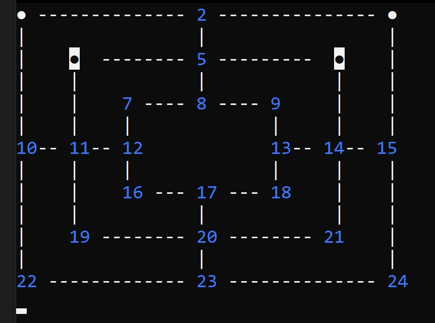

# 1001 Men's Morris

This repo is my homage to an ancient ass game which has captivated my mind for months.  
The game in question is Nine Mens Morris and whilst learning about it I had a quest burn itself in my mind to build an engine which caluclates outcomes, positions and all that malarkey entirely using bitwise operations, hence the dobber of a name  

For more info on what this actually is; this wiki page can elaborate far better than I 
https://en.wikipedia.org/wiki/Nine_men's_morris

Currently there are two renditions in this repo

## Godot 

The last time I was involved in games development was over a decade ago building maps and game addons for Unreal Tournament and kickin it large in XNA Games Studio so this is a huge leap forward for me personally and whilst it's a blast from the past, it's all changed and I'm now marginally more mature as a dev

**Requirements to run:** Godot v4.1.3+ 

### Progress of development
- [X] Displays a board
- [X] Player 1 can place a tile
- [X] Player 2 can place a tile (look, it **is** different alright, there's logic to be added here and I like checkboxes)
- [ ] Combinations of 3 trigger a removal phase
- [ ] Tiles can be removed when in removal phase
- [ ] Removal phase ends after a tile is removed
- [ ] End Game is triggered upon 3 tiles remaining for any player
- [ ] Tiles may move freely in End Game phase
- [ ] When 2 tiles remain for a player, opposing player wins
- [ ] Communication with central server

### Progress of deployment
- [X] Deployment to Steam Deck
- [ ] Deployment to wherever else folk deploy games that naebdy will ever play

### Screenshot

## C# CLI

I specify C# here because I want to write and rewrite this in a bunch of different languages; namely Go and Kotlin 
I also have an aspiration to allow the player to be able to pick their choice of application

**Requirements to run:** .Net 8 SDK

Written in C# dotnet 8, 
A C# dotnet 8 game engine for Nine Men's Morris using bitwise operations and flags to make hings move and groove 

### Progress of development
- [X] Displays a board
- [x] Player 1 can place a tile
- [ ] Player 2 can place a tile (look, it **is** different alright, there's logic to be added here and I like checkboxes)
- [ ] Combinations of 3 trigger a removal phase
- [ ] Tiles can be removed when in removal phase
- [ ] Removal phase ends after a tile is removed
- [ ] End Game is triggered upon 3 tiles remaining for any player
- [ ] Tiles may move freely in End Game phase
- [ ] When 2 tiles remain for a player, opposing player wins
- [ ] Communication with central server

### Progress of deployment
- [ ] Deployment to Github Releases

### Screenshot

## Bonus Points: Main Server

I want to make a centralized server to host the games between players and allow for players to have off-device hosted accounts to save their games 
It's also just a hoot to make a centalized server like this and tackle mad issues like concurrency and aw the hilarity that comes with that bag of fun
Whatever language this ends up being written in, it will almost certainly be hosted within orchestrated containers as I would love to get to the stage where I can stress test this using JMeter or the like

### Progress of development
- [ ] Make a project
- [ ] Create Gamestate endpoints 
- [ ] Save gamestate on update
- [ ] TBD - more to come on this

### Progress of deployment
- [ ] Deployment to local development server
- [ ] Deployment to cloud hosted instance 